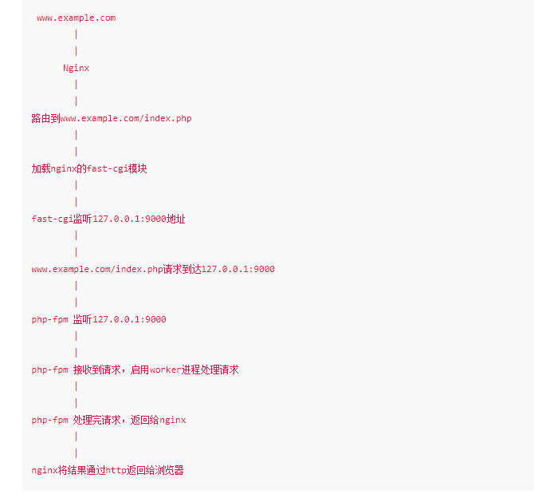

# 背景知识

## CGI

**CGI** 全称：Common Gateway Interface, 中文名：通用网关接口

CGI（Common Gateway Interface）是一种协议，定义了Web服务器与外部程序（如脚本或应用程序）之间的交互方式。它允许Web服务器通过运行外部程序生成动态内容。CGI脚本通常用来处理表单输入、查询数据库或生成动态页面内容。也有定义说CGI属于是一种**接口规范**，它让 **WEB 服务器** 能够执行外部程序，这些外部程序可以是各种不同的语言编写的程序，例如 `.php`, `.asp`, `.jsp`。(这里的 **WEB 服务器** 指的是例如 Nginx 或 Apache 这样的程序)。

举个例子，当一个 URL 请求发送给服务器时，例如：`https://xxx.com/index.php` 我们请求的是 `/index.php` 这个文件，它的`后缀名`会被 Web 服务器程序读取。因为后缀名是 `.php`，那当然就是调用 PHP 的 CGI 程序啦。例如，此刻 Apache 会携带客户端 HTTP 请求时给的参数去调用 `php-cgi.exe`，然后将程序执行的结果响应给客户端。

另外的解释：对 Web 服务器程序调用**其他程序**的规则所做的定义就是 CGI，而按照 **CGI 规范**来工作的程序就称为 **CGI 程序**。

## FastCGI

**Fast**CGI 全称：Fast Common Gateway Interface, 中文名：**快速**通用网关接口。

FastCGI算是早期CGI的增强版本，相较于CGI的处理请求的方式（CGI 采用的是 fork-and-execute 的方式处理数据。当 WEB 服务器接收到请求时，会根据请求的内容 fork 一个新进程 (CGI 程序)。随后，进程处理完数据后，执行结果会返回给 WEB 服务器，WEB 服务器会把内容响应给客户端，刚才 fork 的进程此刻也**随即被释放掉**。如果下一次用户再次请求，WEB 服务器**又会再次 fork 一个新进程**。CGI 这种**反复一开一关**的方式，效率就比较低。），FastCGI使用常驻进程来处理请求，这些进程由**FastCGI Server**进行管理。进程收到数据后立即处理，处理完等待下一个进程，而不是结束进程。所以FastCGI比CGI效率高的原因是常驻内存。由于效率的提升是内存加载多个CGI进程，所以导致FastCGI会比CGI更占内存。

## CGI和FastCGI的总结以及通俗解释

CGI 和 FastCGI 是两个的协议。

CGI 和 FastCGI 协议都不是 PHP 特有的。一般来讲，**任何语言**编写的程序都可以通过 FastCGI/CGI 协议来提供 Web 服务。

CGI 是一种在 HTTP 请求到达时 WEB 服务器时，**执行外部程序** (不仅仅是 PHP) 的方法规范。由于 Web 服务器会为每个传入的请求启动一个新的 CGI 进程，这会导致显著的性能开销。

FastCGI 是一种 “**更好的 CGI**” —— 它解决了 CGI 的痛点，FastCGI 作为一个 Server 运行，可供其他程序调用。FastCGI 常驻内存，不会像 CGI 一样反复开关进程，故性能更优。

简而言之，“FastCGI **设计的更好**，所以比 CGI 效率高”。

通俗来讲，服务器好比是一个餐厅，FastCGI 就是有一群厨师一大早就在厨房守着（常驻进程），客人一来马上做菜，并且 24h 不离开厨房（bushi）。CGI 则是这些厨师并不会在厨房待命，他们悠闲地摸着鱼，在饭店门口游荡（大概是生意不好），只有看到客人进店，才跑去厨房烧锅做菜（创建新进程），做了就从厨房又溜了（进程结束），继续摸鱼:joy:

## PHP-CGI

CGI/FastCGI 是一种**规范**，而 PHP-CGI 是 CGI/FastCGI 规范的**实现**，它是一个 **SAPI**。**SAPI**在PHP中的作用，类似于一个消息的“传递者”，他的作用就是接受Web容器通过FastCGI协议封装好的数据，并交给PHP解释器执行。例如`PHP-FPM`,`mod_php`等。

PHP-CGI也是一个SAPI。在远古的时候，web应用的运行方式很简单，web容器接收到http数据包后，拿到用户请求的文件（cgi脚本），并fork出一个子进程（解释器）去执行这个文件，然后拿到执行结果，直接返回给用户，同时这个解释器子进程也就结束了。基于bash、perl等语言的web应用多半都是以这种方式来执行，这种执行方式一般就被称为cgi，在安装Apache的时候默认有一个cgi-bin目录，最早就是放置这些cgi脚本用的。PHP-CGI有两个功能，一是提供cgi方式的交互，二是提供fastcgi方式的交互。也就说，我们可以像perl一样，让web容器直接fork一个php-cgi进程执行某脚本；也可以在后台运行`php-cgi -b 127.0.0.1:9000`（php-cgi作为fastcgi的管理器），并让web容器用fastcgi协议和9000交互。

## PHP-FPM

在早期web-server时没有cgi的概念，因为大都是html静态文件，但是后来出现了php等动态语言，我们需要交给php解释器来处理。让php解释器和webserver进行通信时，就产生了cgi协议。但是由于其每次都要开关进程，非常浪费资源，于是出现了fastcgi，利用一个进程一次处理多个请求。而php-fpm（php-Fastcgi Process Manager）就是fastcgi的实现，并提供了进程管理的功能。进程包含 master 进程和 worker 进程两种进程。master 进程只有一个，负责监听端口，接收来自 Web Server 的请求，而 worker 进程则一般有多个(具体数量根据实际需要配置)，每个进程内部都嵌入了一个 PHP 解释器，是 PHP 代码真正执行的地方。

工作流程图：

# 环境搭建

虚拟机：Windows 10 x64

PHP开发环境：[XAMPP](https://www.apachefriends.org/)

