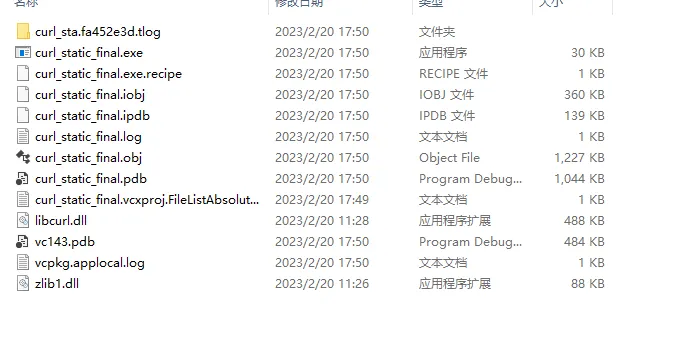
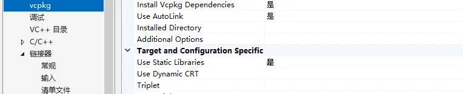
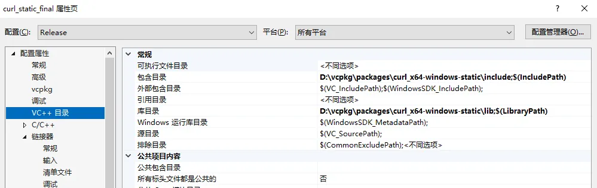
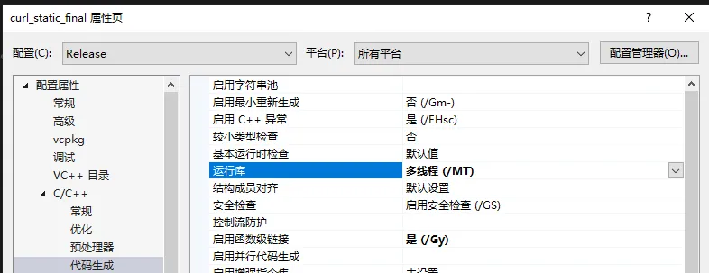
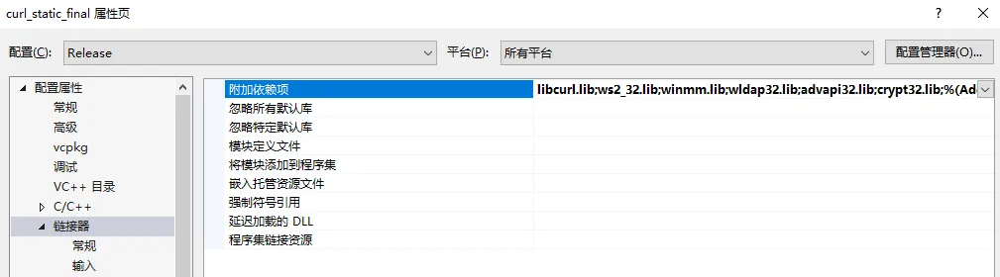

# 环境配置
IDE:VS2022

包管理器:vcpkg

# 下载静态库
创建一个新的C++空项目，然后通过vcpkg包管理器下载curl静态库
```bash
vcpkg install curl[core,non-http,schannel,ssl,sspi]:x64-windows-static
```
# C++实现
## 实例代码
实现一个简单的C++请求代码
```cpp
#include <curl/curl.h>
#include <fstream>
#include <iostream>
#include <string>

static size_t WriteCallback(void* contents, size_t size, size_t nmemb, void* userp)
{
    ((std::string*)userp)->append((char*)contents, size * nmemb);
    return size * nmemb;
}

std::string httpGetRequest(std::string url)
{
    CURL* curl;
    CURLcode res;
    std::string response;

    curl = curl_easy_init();
    if (curl) {
        curl_easy_setopt(curl, CURLOPT_URL, url.c_str());
        curl_easy_setopt(curl, CURLOPT_WRITEFUNCTION, WriteCallback);
        curl_easy_setopt(curl, CURLOPT_WRITEDATA, &response);
        res = curl_easy_perform(curl);
        if (res != CURLE_OK) {
            fprintf(stderr, "curl_easy_perform() failed: %s\n",
                curl_easy_strerror(res));
        }
        curl_easy_cleanup(curl);
    }

    return response;
}

void writeStringToFile(std::string filename, std::string content)
{
    std::ofstream outfile(filename);
    if (outfile.is_open()) {
        outfile << content;
        outfile.close();
    }
    else {
        std::cerr << "Failed to open file " << filename << " for writing" << std::endl;
    }
}

int main(void)
{
    std::string url = "https://example.com/file.txt";
    std::string response = httpGetRequest(url);
    std::string filename = "output.txt";
    writeStringToFile(filename, response);
    return 0;
}
```
## 编译运行
编译运行后会伴有libcurl.dll和zlib1.dll文件生成。



<!---->


# 静态链接设置

1. 将vcpkg设置为使用静态库



2. 在vc++目录添加包含目录和库目录，分别对应vcpkg中的include文件夹以及lib文件夹



3. C/C++->代码生成->运行库->多线程MT



4. 在链接器->输入->附加依赖项中加入 



5. 编译运行，发现已经不包含dll文件，并且在外部环境也可直接运行。
# 一些报错的所需库
```
ws2_32.lib
error LNK2001: 无法解析的外部符号 __imp_htons
error LNK2001: 无法解析的外部符号 __imp_ntohl
error LNK2001: 无法解析的外部符号 __imp_ntohs
error LNK2019: 无法解析的外部符号 in6addr_any
error LNK2001: 无法解析的外部符号 __imp_htonl
error LNK2019: 无法解析的外部符号 in6addr_loopback

d3d11.lib
error LNK2019: 无法解析的外部符号 D3D11CreateDevice

winmm.lib
error LNK2019: 无法解析的外部符号 __imp_timeKillEvent
error LNK2019: 无法解析的外部符号 __imp_timeBeginPeriod
error LNK2019: 无法解析的外部符号 __imp_timeEndPeriod
error LNK2019: 无法解析的外部符号 __imp_timeSetEvent
error LNK2019: 无法解析的外部符号 __imp_timeGetTime

crypt32.lib
error LNK2019: 无法解析的外部符号 __imp_CertOpenStore
error LNK2019: 无法解析的外部符号 __imp_CertCloseStore
error LNK2019: 无法解析的外部符号 __imp_CertEnumCertificatesInStore
error LNK2019: 无法解析的外部符号 __imp_CertFindCertificateInStore
error LNK2019: 无法解析的外部符号 __imp_CertDuplicateCertificateContext
error LNK2019: 无法解析的外部符号 __imp_CertFreeCertificateContext
error LNK2019: 无法解析的外部符号 __imp_CertGetCertificateContextProperty

secur32.lib
error LNK2019: 无法解析的外部符号 InitializeSecurityContextA
error LNK2019: 无法解析的外部符号 AcquireCredentialsHandleA
error LNK2019: 无法解析的外部符号 __imp_FreeCredentialsHandle
error LNK2019: 无法解析的外部符号 CompleteAuthToken
error LNK2019: 无法解析的外部符号 __imp_DeleteSecurityContext

msdmo.lib
error LNK2019: 无法解析的外部符号 MoInitMediaType
error LNK2019: 无法解析的外部符号 MoFreeMediaType

wmcodecdspuuid.lib
error LNK2019: 无法解析的外部符号 CLSID_CWMAudioAEC

dmoguids.lib
error LNK2019: 无法解析的外部符号 IID_IMediaObject
error LNK2019: 无法解析的外部符号 IID_IMediaBuffer

strmiids.lib
error LNK2019: 无法解析的外部符号 IID_ICreateDevEnum
error LNK2019: 无法解析的外部符号 IID_IBaseFilter
error LNK2019: 无法解析的外部符号 IID_IAMExtDevice
error LNK2019: 无法解析的外部符号 IID_IAMStreamConfig
error LNK2019: 无法解析的外部符号 IID_IAMVideoControl
error LNK2019: 无法解析的外部符号 IID_IGraphBuilder
error LNK2019: 无法解析的外部符号 IID_IMemInputPin
error LNK2019: 无法解析的外部符号 IID_IPin
error LNK2019: 无法解析的外部符号 IID_IMemAllocator
error LNK2019: 无法解析的外部符号 IID_IEnumMediaTypes
error LNK2019: 无法解析的外部符号 IID_IEnumPins

advapi32.lib
error LNK2019: 无法解析的外部符号 __imp_RegQueryValueExW
error LNK2019: 无法解析的外部符号 __imp_RegCloseKey
error LNK2019: 无法解析的外部符号 __imp_RegOpenKeyExW
error LNK2019: 无法解析的外部符号 __imp_DeregisterEventSource
error LNK2019: 无法解析的外部符号 __imp_RegisterEventSourceW
error LNK2019: 无法解析的外部符号 __imp_ReportEventW
error LNK2019: 无法解析的外部符号 __imp_CryptAcquireContextW
error LNK2019: 无法解析的外部符号 __imp_CryptReleaseContext
error LNK2019: 无法解析的外部符号 __imp_CryptDestroyKey
error LNK2019: 无法解析的外部符号 __imp_CryptSetHashParam
error LNK2019: 无法解析的外部符号 __imp_CryptGetProvParam
error LNK2019: 无法解析的外部符号 __imp_CryptGetUserKey
error LNK2019: 无法解析的外部符号 __imp_CryptExportKey
error LNK2019: 无法解析的外部符号 __imp_CryptDecrypt
error LNK2019: 无法解析的外部符号 __imp_CryptCreateHash
error LNK2019: 无法解析的外部符号 __imp_CryptDestroyHash
error LNK2019: 无法解析的外部符号 __imp_CryptSignHashW
error LNK2019: 无法解析的外部符号 __imp_CryptEnumProvidersW

gdi32.lib
error LNK2019: 无法解析的外部符号 __imp_CreateRectRgn
error LNK2019: 无法解析的外部符号 __imp_GetRgnBox
error LNK2019: 无法解析的外部符号 __imp_DeleteObject
error LNK2001: 无法解析的外部符号 __imp_DeleteObject
error LNK2019: 无法解析的外部符号 __imp_GetCurrentObject
error LNK2019: 无法解析的外部符号 __imp_GetObjectW
error LNK2019: 无法解析的外部符号 __imp_CreateCompatibleDC
error LNK2001: 无法解析的外部符号 __imp_CreateCompatibleDC
error LNK2019: 无法解析的外部符号 __imp_SelectObject
error LNK2001: 无法解析的外部符号 __imp_SelectObject
error LNK2019: 无法解析的外部符号 __imp_BitBlt
error LNK2001: 无法解析的外部符号 __imp_BitBlt
error LNK2019: 无法解析的外部符号 __imp_DeleteDC
error LNK2001: 无法解析的外部符号 __imp_DeleteDC
error LNK2019: 无法解析的外部符号 __imp_GetDeviceCaps
error LNK2001: 无法解析的外部符号 __imp_GetDeviceCaps
error LNK2001: 无法解析的外部符号 __imp_GetDeviceCaps
error LNK2019: 无法解析的外部符号 __imp_CreateDIBSection

```
